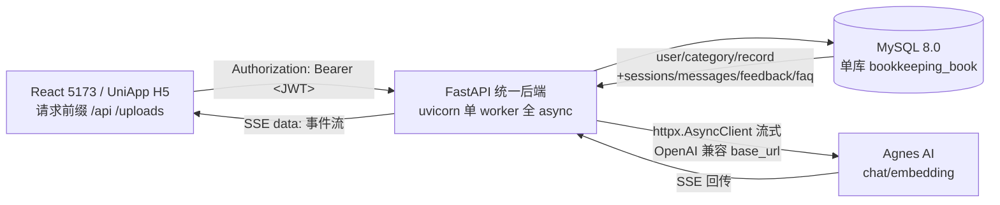

# 智能个人记账管理系统 — FastAPI 统一后端开发文档（索引 / 总览）

> 定位：本套文档是将现有 **Spring Boot(8080) + Express/Node(3001) 双后端**迁移为**统一 FastAPI 后端**的开发规格书，**字段级精度、可直接照着逐接口实现**。
>
> 阅读对象：需要动手实现全部接口的开发者（本人）。
> 版本：v1 · 2026-09-08 · 来源仓库：`e:/一些毕设探索/记账管理系统_fastapi`

---

## 0. 文档导航

| # | 文档 | 内容 | 实现顺序 |
|---|------|------|----------|
| 00 | `00-README.md`（本文） | 架构、全局约定、决策记录、存量事实与 Bug、风险清单 | 先读 |
| 01 | `01-工程骨架与环境.md` | 目录树、依赖清单、配置项映射、启动方式 | ① |
| 02 | `02-数据库设计.md` | MySQL 单库全表 DDL、索引、时间单位、自动填充等价方案 | ① |
| 03 | `03-通用组件.md` | Result/PageResult、错误码、异常映射、鉴权依赖、JWT、上传校验 | ② |
| 04 | `04-业务接口规范.md` | `/api/user` `/api/categories` `/api/records` `/api/statistics` `/api/admin` 逐接口规格 | ③ |
| 05 | `05-AI接口规范.md` | `/api/ai/**` 逐接口规格、SSE 字节格式、「不套 Result」警示 | ④ |
| 06 | `06-AI模块设计.md` | chat/analyze/faq/memory 签名与 Prompt 全文、LangChain 主方案 + 轻量 SDK 对照 | ④ |
| 07 | `07-任务与部署.md` | APScheduler 清理任务、uvicorn/gunicorn、nginx SSE、Windows 流程 | ⑤ |
| 08 | `08-迁移手册.md` | sql.js→MySQL 脚本设计、BCrypt 验证、JWT 无缝切换、灰度回滚、验收清单 | ⑥ |
| 10 | `10-实现骨架.md` | 沿用 API文档.md 排版的逐接口 FastAPI 填空骨架（37 接口 + TODO 实现区 + 差异说明表） | ③⑤（配合 04/05/06 直接填空） |

实现顺序说明：01→02 建立工程与库 → 03 通用组件 → 04 业务接口（不依赖 AI）→ 05/06 AI 模块（依赖 02 的 chat 表与 03 的鉴权）→ 07 收尾 → 08 最后执行迁移与验收。实现接口时优先打开 `10-实现骨架.md` 直接填空。

---

## 1. 目标架构

迁移后为**单后端、单进程、全异步**：

与现状的对应关系：

| 现状 | 迁移后 | 说明 |
|------|--------|------|
| Spring Boot :8080（对外网关） | FastAPI 单服务（建议同用 8080，前端代理零改动） | 前端 `vite.config.js` 两段代理 `/api` 与 `/uploads` 均指向 8080，改 FastAPI 后**无需改前端** |
| Express :3001（被 Java 转发） | FastAPI 内部模块 `app/ai/*` | 消除 584 行 `AiController` 手工 HTTP 转发 |
| MySQL `user/category/record` | 保持不变 | — |
| sql.js 内存 SQLite `data/chat.db` | 合并进 MySQL（新增 4 张 chat 表） | 消除全库内存 + `export()` 双倍峰值 |
| `uploads/avatars/` 静态目录 | FastAPI `StaticFiles` 挂载 `/uploads/avatars` | — |

---

## 2. 全局约定（单一事实来源，其余文档只引用不重定义）

### 2.1 通用约定

| 约定 | 值 |
|------|-----|
| 统一前缀 | 所有接口均在 `/api` 之下 |
| 响应包装 | **业务接口**统一 `{"code":200,"message":"...","data":...}`；**`/api/ai/**` 一律返回裸 JSON，禁止套 Result**（前端 `AiChat.jsx` 直接读裸结构） |
| 分页结构 | 业务 `PageResult`：`{records,total,pages,current,size}`；AI 会话列表为 **`{items,total}`**（注意两个分页结构不同！） |
| 字段命名 | 对外 JSON 一律 **camelCase**（库表 snake_case → 输出驼峰），AI 会话相关保持英文原样（`categoryName` 等） |
| 金额 | 数据库 `DECIMAL(10,2)`；统计中 `percentage` 为 1 位小数 |
| 时间 | **业务表**：MySQL `DATETIME`，输出 ISO（如 `2026-09-08T10:00:00`）；**AI 会话表：毫秒 BIGINT**（前端 `Date.now()` 直接比对，兼容 `formatRelative`），输出数字 |
| 日期 | 业务 `records.date` 为 `DATE`（旧库列名 `record_date`，已改），`recordDate` 入参字符串格式 `yyyy-MM-dd` |
| 表名与列名 | 定稿见 **02 §0**：业务表复数（`users`/`user_token`/`categories`/`records`），AI 表单数（`sessions`/`messages`/`feedback`/`faq`）；时间列 `created_at`/`updated_at`；`type` 统一 **0=支出/1=收入**（前端硬约束，见 02 §0 说明） |
| 用户标识 | JWT 载荷 `sub` = userId 字符串；登录态由鉴权依赖注入（见 03） |
| 多租户隔离 | 所有业务查询强制带 `user_id = 当前用户`；AI 会话按 `sessions.user_id` 过滤 |

### 2.2 错误与状态码映射（源自 Java 行为）

| 场景 | HTTP 状态 | body.code | message 示例 | 来源 |
|------|-----------|-----------|---------------|------|
| 成功 | 200 | 200 | 操作成功 | `Result.java` |
| 参数校验失败 | 400 | 400 | 字段校验 message（中文） | `GlobalExceptionHandler` 400 |
| 未登录/无 token/token 失效 | 401 | 401 | 未登录 / 用户不存在 / token无效或已过期 | `LoginInterceptor` |
| 无管理员权限 | 403 | 403 | 无管理员权限 | `AdminInterceptor` |
| 业务失败（RuntimeException） | 500 | 500 | `e.getMessage()`（中文） | `GlobalExceptionHandler` 500 |

> ⚠️ 前端 `api/request.js` 只对 HTTP 401 做「清 token 跳登录」，其余以 HTTP 非 2xx 走 `reject`。因此 **HTTP 状态码语义必须与上表一致**，不能把业务错误统一 200。

### 2.3 分页与参数默认值

| 位置 | page 默认 | size 默认 | size 上限 | 非法处理 |
|------|-----------|-----------|-----------|----------|
| 业务列表（records/admin） | 1 | 10 | —（Java 未限，建议限 100） | — |
| AI 会话列表 | 1 | 20 | 100 | Java：`page<1→1`，`size` 夹取 `1..100`；sort/order 非法返回 `{error:"..."}` |

### 2.4 前端零改动硬约束（必须逐条满足）

来源：`personal-ledger-frontend/src/api/request.js`、`pages/AiChat.jsx`、`pages/*.jsx`、`vite.config.js`

1. axios `baseURL=/api`，请求头注入 `Authorization: Bearer <token>`，拦截器 `return response.data` → **业务接口返回体必须整体是 `Result`**。
2. `/api/ai/**` 用原生 `fetch`（不经 axios）读取裸 JSON：`createSession` 读 `data.id`；`GET /sessions/{id}/messages` 期望**数组**；会话列表（经 axios）期望 **`{items,total}`**。
3. SSE：`fetch` + `ReadableStream` 手动解析，**只认 `data: ` 前缀行**，`JSON.parse` 后按 `type ∈ content | error | done` 处理；每事件内容即 `{type,content}` / `{type:"error",error}` / `{type:"done"}`。
4. 401 时前端清 token 跳登录（见 2.2）。
5. 头像上传：`multipart/form-data`，字段名 **`file`**；图片 `` 用 `/uploads/avatars/...`（Vite 已代理 `/uploads`），FastAPI 必须提供该静态路由。

---

## 3. 关键技术决策记录（ADR）

| ADR | 决策 | 理由 | 影响 |
|-----|------|------|------|
| D1 | AI 会话四表 **合并进 MySQL** | 消除 sql.js 全库内存与 `export()` 双倍峰值；单库统一事务；答辩叙事清晰 | 需一次性迁移脚本（08） |
| D2 | AI 实现 **LangChain Python 为主 + openai SDK 轻量对照** | 与现有 LangChain.js 结构一一对应，行为保真；轻量版降低理解成本 | 06 双方案 |
| D3 | **单 worker + 全 `async def`** | 内存收益的前提；SSE 长连接不阻塞线程池 | 07 部署、性能红线 |
| D4 | SSE 用 `StreamingResponse` + `httpx.AsyncClient` 流式转发 | 替代 Java 的 `HttpURLConnection` 逐行透传 | 05/06 |
| D5 | 保留 HS256 同一密钥签发/校验 JWT | 旧 token 24h 内无缝过渡，可灰度 | 03/08 |
| D6 | BCrypt 兼容层（`$2a$`）并在迁移前做**存量 hash 实测** | Spring `BCryptPasswordEncoder` 强度 10 产物是 `$2a$10$...`，passlib/bcrypt 存在前缀与版本坑 | 03/08（最高优先级） |
| D7 | 定时清理用 APScheduler，**仅在单 worker 下启动** | 避免多 worker 重复执行物理删除 | 07 |
| D8 | 后端端口沿用 **8080**（或文档写明可切换） | 前端代理零改动 | 07 |

---

## 4. 存量事实核对表（写接口时以此为准，勿臆造）

以下字段与行为已从源码核实，详见各分文档并标注了来源文件：

- 业务表实体字段：`User/Category/Record`（见 02）
- 接口 DTO 校验规则（正则等）：`RegisterDTO` 用户名字段 `^[A-Za-z0-9\u4e00-\u9fa5]{2,20}$`、密码 `^\d{6}$`（6 位数字），改密 `PasswordUpdateDTO` 同规则；`RecordDTO.recordDate` 为 `yyyy-MM-dd` 字符串（见 04）
- 统计 SQL 与百分比算法（1 位小数 HALF_UP）（见 04）
- AI 会话 JSON 结构（见 05/06）
- LangChain Prompt 与结构化输出 Schema（Zod→Pydantic 字段翻译）（见 06）

---

## 5. 已核实的存量 Bug / 隐患清单（迁移时顺手修复或保持，标注在对应分文档）

| # | 位置 | 问题 | 处置建议 |
|---|------|------|----------|
| B1 | `chatbot-server/db.ts` searchFAQ | SQL 写错：`... OR answer ? LIMIT 5`（缺 `LIKE`），关键词降级长期抛错被吞 | 修复（02/05 中给出正确写法） |
| B2 | Express `/api/admin/conversations`、`/api/admin/satisfaction` | Java **从未转发**，属死接口 | 迁移文档要求「以 Express 路由表为基准核对，勿漏」；若前端未用可暂不迁移，在 05 标注 |
| B3 | `AiController` 类注释 | 声明 `/api/analyze/summary` 未实现 | 不实现，保持与现状一致 |
| B4 | `StatisticsMapper.get_monthly_records` | 无实现死代码（真实现为 `RecordMapper.getMonthlyStats`） | 忽略 |
| B5 | 前端 `AiChatDrawer.jsx` | 期望 `GET /api/ai/sessions` 返回 `{sessions:[...]}`，与后端 `{items,total}` 不符（遗留抽屉组件） | **以主页面 `AiChat.jsx` 为准实现 `{items,total}`**，不迁就抽屉 |
| B6 | 管理端 `getAllRecords` | `type` 过滤在 **分页后内存过滤**，导致当前页数量与 total 不一致 | 建议迁移时改为 SQL JOIN 条件过滤（见 04），并在文档说明行为差异 |
| B7 | 删除分类无级联 | 删除分类后历史 record 的 `category_id` 悬空，统计按 LEFT JOIN 归 NULL 不计 | 保持现状即可，文档注明 |
| B8 | `application.yml` 无 `ddl-auto` | 库结构靠外部 SQL/手动创建；本文档 02 给出目标 DDL，需与现有库核对后再执行 | 见 02 末尾核对清单 |

---

## 6. 风险与前置验证（按优先级）

1. **BCrypt 兼容**（致命级）：先用存量真实 hash 验证 `passlib`/`bcrypt` 可验 `$2a$10$...`；通过率 100% 才切换；预留强制重置密码兜底。详见 08。
2. **SSE 必须 async**：若用同步 `def` 端点转发流式，单 worker 下并发会话将耗尽线程池 → 全链路 async + httpx 流式。详见 05/06。
3. **双返回契约**：业务接口忘套 Result 或 `/api/ai/**` 误套 Result，前端大面积报错 → 03/05 用分组隔离，并跑契约比对。
4. **LangChain Python Prompt 大括号转义**：`{}` 需写成 `{{}}`，否则 `KeyError`。详见 06。
5. **金额/日期类型漂移**：MySQL `DECIMAL` 与毫秒时间戳别混；AI 会话时间戳用 int 毫秒。
6. **字段名映射**：MySQL snake_case → JSON camelCase 必须在序列化层统一完成，勿泄漏 `category_id` 之类的键。

---

## 7. 快速参考（常用路径）

- 现状 Java 源码根：`backend/test_backend/src/main/java/com/example/test_backend/`
- 现状 Express 源码根：`chatbot-server/`
- 前端 API 封装：`personal-ledger-frontend/src/api/*.js`
- 本套文档目录：`docs/fastapi-backend/`

## 8. 阅读建议

1. 先通读本文档「全局约定 + Bug + 风险」。
2. 再读 `01` 与 `02`，把工程与库建好。
3. 实现 `03` 通用组件后，按 `10-实现骨架.md` 配合 `04` 逐接口填空实现并用 `curl`/浏览器回归（业务接口不依赖 AI）。
4. 实现 `05/06` AI 模块（核心难点），骨架见 `10`；对照 `08` 迁移历史数据并做验收。
