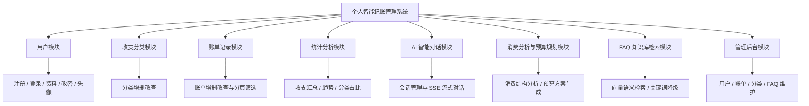
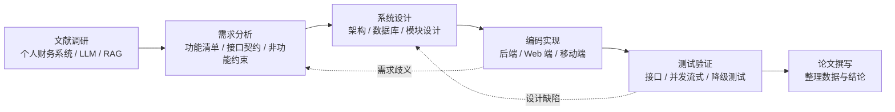
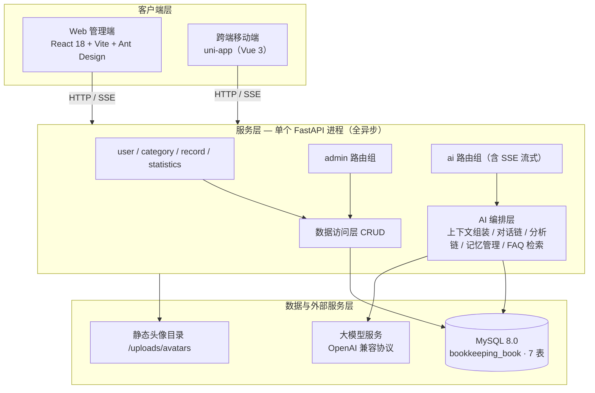
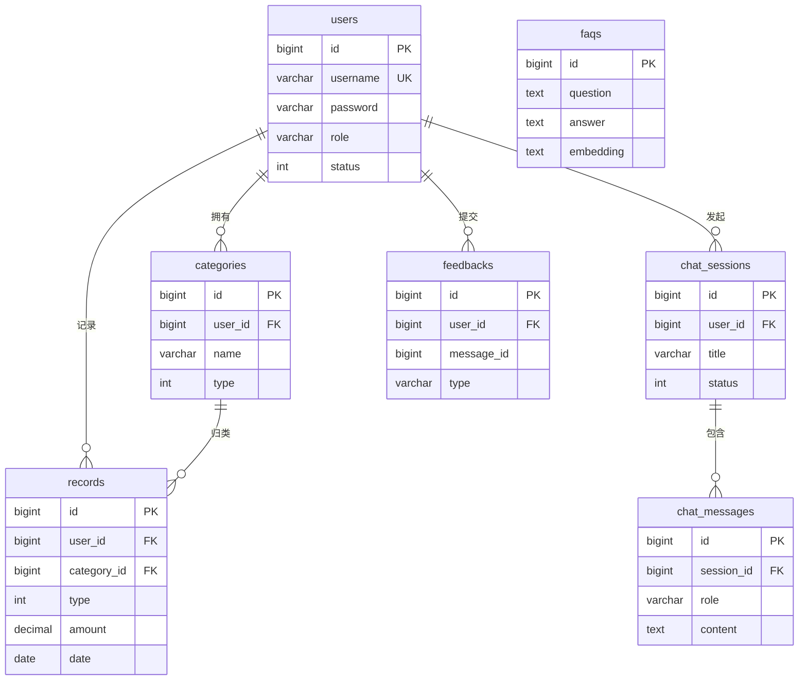
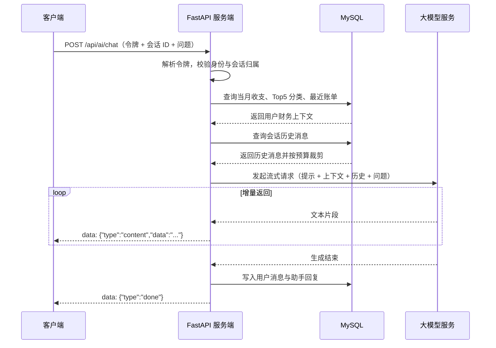

# 本科毕业设计（论文）开题报告

**题目：基于 FastAPI 与大语言模型的个人智能记账管理系统的设计与实现**

- 学科方向：【专业】
- 完成形式：个人独立完成，教师指导
- 交付物：可运行的多端系统一套 + 毕业论文一篇

---

## 一、选题背景与意义

### （一）研究背景

移动支付的普及使个人消费高度碎片化：一笔支出可能在一日之内分散于若干渠道，单笔金额小、发生频次高，用户依靠回忆或事后补录完成记账的难度显著上升。个人财务管理软件因此成为稳定的应用需求，用户希望通过分类归档与统计图表，把散乱的生活消费还原为可观察的收支结构。

然而现有记账类产品的功能边界长期停留在"记录—分类—统计"这条主线上，能回答"这个月花了多少"，却无法回答"这样的消费结构是否健康"。这类问题需要结合用户的个人历史数据进行归纳、对比与推断，而非简单聚合求和，传统规则引擎难以覆盖。

大语言模型（Large Language Model，LLM）为此提供了新的技术路径，可将交互方式从"填表单"转变为"直接提问"。但将其落入真实系统面临三类工程困难：一是架构整合，原型系统由 Spring Boot 网关、Express AI 服务与 sql.js 内存库三个进程构成，部署形态与存储方式互不相同，数据无法统一查询；二是流式输出与阻塞调用的冲突，任一环节使用同步阻塞调用都会在单进程模型下随并发会话数上升而耗尽工作线程；三是模型输出的不可控性，其输出为自然语言而前端渲染依赖固定字段。

本课题即以解决上述问题为出发点，将三进程原型重构为单个 FastAPI 全异步进程，在保留传统记账能力的基础上实现 LLM 驱动的智能问答、消费分析、预算规划与知识库检索，并保证外部服务不可用时系统仍能降级运行。

### （二）研究意义

**1. 理论意义**

本课题在完整应用系统中检验两项工程方法。其一为异构多后端向单进程全异步架构整合的方法：在不改动既有客户端接口契约的前提下，把跨进程调用收敛为进程内调用，把两套独立的持久化方案统一到单一关系库。其二为 LLM 结构化输出的可靠性保障方法：通过输出模式约束与数据模型校验，把模型自由文本转化为可被程序消费的结构化结果，并设计校验失败的降级路径，使"模型不可靠"不至于演化为"系统不可靠"。课题还涉及长对话的上下文成本控制。

**2. 实践意义**

课题交付一套可运行的多端系统，覆盖 Web 管理端与跨端移动端，可运行于浏览器、微信小程序与移动应用。对用户而言，记账由"事后补录"变为"对话式记录与解读"，降低了持续记账负担。对开发者而言，课题沉淀出面向个人财务场景的 LLM 接入范式，包括财务上下文组装、结构化分析链设计与检索增强的降级设计。

---

## 二、国内外研究现状及发展趋势

### （一）个人财务管理软件的研究与应用现状

个人财务管理（Personal Financial Management，PFM）软件的研究与应用在国外起步较早。以 Mint 为代表的平台通过聚合账户流水自动生成消费分类与月度报表，验证了"自动归集 + 分类可视化"这一产品形态；以 YNAB 为代表的零基预算工具引入"每笔收入都需预先分配用途"的预算方法论，把记账从事后记录推进到事前约束。国内方面，随手记、鲨鱼记账等产品在分类管理、图表统计与多账本支持上积累了完整经验，第三方支付平台内置的账单功能则借助交易数据的天然可得性把记录成本降到极低。

评述上述工作可见，该方向的功能设计已趋同于"记账 + 分类 + 图表"三位一体，研究重心多集中于数据采集的自动化程度与可视化呈现效果，局限亦随之显现：一是产品普遍"重记录、轻解释"，把数据解读责任完全交给用户；二是多端一致性问题突出，同一套业务逻辑在 Web 端与移动端往往重复实现；三是面向个人场景的预算规划仍以固定比例模板为主，与用户真实的历史消费结构结合不足。

### （二）大语言模型在个人理财场景的应用现状

大语言模型在金融领域的应用是近年研究热点。Wu 等人提出的 BloombergGPT 面向金融领域构建专用大模型，通过大规模金融语料训练验证了领域语料对金融任务的提升作用；Yang 等人提出的 FinGPT 强调以数据为中心，通过低成本微调与开源协作降低金融大模型的使用门槛。两项工作共同确立了一个基本判断：通用大模型在金融语义任务上存在提升空间，领域适配能够带来实质收益。

在个人理财场景中，大模型应用研究主要集中在智能投顾、消费行为解释与财务问答三类任务上。这类任务数据规模小、个体差异大、结论需通俗表达，更适合"通用模型 + 个性化上下文"的组合，而非训练领域专用模型。

评述现有工作可见三处未解决的问题：大模型普遍缺乏用户层面的个性化财务上下文，回答容易流于泛泛；自由文本输出难以直接驱动界面渲染，而对其输出约束与校验的工程化讨论不足；长对话场景下上下文长度与调用成本的矛盾缺乏系统性处理方案。

### （三）检索增强生成技术的研究现状

检索增强生成（Retrieval-Augmented Generation，RAG）由 Lewis 等人提出，核心思想是在生成前先从外部知识库检索相关内容，将检索结果作为上下文一并送入模型，以缓解知识过期与事实幻觉。在检索环节，Karpukhin 等人提出的稠密段落检索以双塔结构将问题与文档映射到同一向量空间，通过向量相似度完成召回，提升了开放域问答的检索质量。上述工作确立了"向量化—相似度检索—上下文注入"的技术框架，已成为知识库问答系统的主流实现方式。

评述该方向可见，现有研究在检索效果与索引质量上积累充分，但对系统可用性讨论薄弱。RAG 的向量化环节通常依赖外部 Embedding 服务，一旦出现网络异常、限流或额度耗尽，整条问答链路将直接失效。对于个人记账这类工具型应用，这一风险缺乏针对性设计。

### （四）现有研究的不足与本文的切入点

综合三个方向，现有研究存在三处不足：个人财务管理软件研究偏重功能实现与界面呈现，对系统内部架构的整合讨论较少；大模型在个人理财场景的应用尚未解决输出可靠性问题，"模型能生成"与"程序能用"之间存在工程断层；检索增强生成的研究对服务降级条件下的可用性设计关注不足。

本文的切入点相应落于三处：以个人记账系统为载体，实现异构多后端到单 FastAPI 全异步进程的架构整合；围绕前端可渲染的结构化数据这一目标，研究模型输出的约束、校验与降级机制；设计检索增强的降级路径，使 FAQ 问答在向量服务不可用时仍可返回结果。

---

## 三、研究目标、研究内容与拟解决的关键问题

### （一）研究目标

本课题拟设计并实现一套面向个人用户的智能记账管理系统，目标包括三项。第一，构建覆盖桌面与移动场景的多端应用，移动端可编译为 H5、微信小程序与 App，两端共用同一后端服务。第二，在传统记账能力之上实现四项智能化能力：基于 Server-Sent Events（服务器发送事件，SSE）的流式智能问答、结构化消费分析、基于 50/30/20 法则的预算规划，以及基于检索增强的 FAQ 知识库问答。第三，完成架构重构，把多进程异构结构收敛为单个 FastAPI 全异步进程，并将分散的会话数据合并至统一关系库。

### （二）研究内容

系统由客户端、服务端与数据层构成，功能上划分为八个模块，其层次结构如图 1 所示。

**图 1 系统功能结构图**

客户端层方面，Web 端包含登录、注册、数据概览、账单管理、分类管理、个人信息、修改密码、AI 对话及三个管理后台页面共 11 个页面；移动端包含登录、注册、数据概览、账单列表、账单增改、分类、个人中心与 AI 对话等页面。服务端按资源划分为用户、分类、账单、统计、管理后台与 AI 助手六组路由，共设计 38 个 REST 接口，其中业务接口 24 个、AI 接口 14 个，另设 1 个健康检查接口。数据层采用 MySQL 单库设计，共 7 张数据表，统一使用 InnoDB 引擎与 utf8mb4 字符集。

### （三）拟解决的关键问题

**1. 异构多后端到单进程全异步的架构整合。** 原系统 AI 能力由独立进程提供，会话数据存放于内存库且需整体导出。整合后 AI 变为进程内调用、会话数据并入关系库，需重新设计数据访问层以适配异步驱动。

**2. 前端零改动的接口契约约束。** 客户端已按既定路径、字段名与响应结构实现，后端重构不得更改。同时系统并存两套响应契约：业务接口统一包裹为 `{code, message, data}` 信封，AI 接口返回相应业务数据，二者分页结构亦不相同。

**3. SSE 流式输出的全链路异步化。** 数据库访问、模型调用与响应转发须全程异步，任一环节引入同步阻塞都会在单进程模型下导致服务整体不可用。

**4. 大模型结构化输出的可靠性。** 消费分析与预算规划的结论须被前端稳定渲染。拟采用输出模式约束与 Pydantic 数据模型校验相结合的方式，校验失败即降级为错误响应，避免不合规数据进入持久层。

**5. 检索增强与降级的可用性。** 需设计降级路径，在向量服务不可用时自动切换为关键词检索，保证问答链路不整体失效。

**6. 长对话的上下文成本控制。** 历史消息持续累积将带来显著调用成本，需在有限上下文预算内保留关键信息。

**7. 多租户数据隔离与权限控制。** 业务查询须强制携带当前用户条件，会话读取需校验归属与删除状态，管理端接口叠加角色校验。

**8. 统计查询的性能与数据正确性。** 原实现以函数形式对日期列提取年月，无法命中索引，需改写为等价的可索引区间条件，并统一占比舍入规则。

---

## 四、研究方案与技术路线

### （一）总体技术路线

课题按"文献调研—需求分析—系统设计—编码实现—测试验证—论文撰写"顺序推进，并保持迭代回退：测试发现的设计缺陷回退至设计阶段，实现阶段暴露的需求歧义回退至需求分析阶段。总体技术路线如图 5 所示。

**图 5 研究技术路线图**

### （二）系统架构设计

系统采用三层结构。客户端层由 Web 端与跨端移动端组成，通过统一 HTTP 接口访问服务端。服务层为单个 FastAPI 进程，全链路异步实现，对外提供 REST 与 SSE 接口。数据与外部服务层由 MySQL 单库、静态文件目录与外部大模型服务构成，模型服务通过 OpenAI 兼容协议调用。总体架构如图 2 所示。

**图 2 系统总体架构图**

技术栈选型如表 1 所示。

**表 1 技术栈选型表**

| 层次 | 技术选型 | 选型理由 |
|---|---|---|
| Web 前端 | React 18、Vite 5、Ant Design 5、axios、dayjs | 组件生态成熟，适配中后台界面 |
| 移动端 | uni-app（Vue 3）、pinia | 一套代码覆盖 H5 / 小程序 / App，降低多端成本 |
| 后端框架 | FastAPI、uvicorn | 原生异步，自动生成 OpenAPI 文档 |
| ORM 与驱动 | SQLAlchemy 2.0（异步）、aiomysql | 全异步访问，与 SSE 长连接共存不阻塞 |
| 校验与配置 | Pydantic 2、python-dotenv | 强类型校验，配置集中由 `.env` 管理 |
| 认证安全 | PyJWT（HS256）、bcrypt | 无状态鉴权，口令哈希存储 |
| AI 编排 | LangChain 为主方案，openai SDK 与 httpx 为对照 | 便于链式编排与结构化输出绑定 |
| 实时通信 | Server-Sent Events | 较 WebSocket 更轻，可穿透 HTTP 基础设施 |
| 定时任务 | APScheduler | 清理过期软删除会话 |
| 数据库 | MySQL 8.0 | 事务与索引能力满足账务数据准确性 |
| 部署 | gunicorn + UvicornWorker + nginx | 进程守护与 SSE 反向代理 |

### （三）数据库设计

数据库采用单库设计，命名遵循 snake_case 规范，对外 JSON 由 Pydantic 序列化为 camelCase。主键统一为自增 BIGINT，金额字段统一采用 `DECIMAL(10,2)` 类型，禁止以浮点类型存储金额，创建时间与更新时间由 ORM 时间戳混入类自动填充。各表通过 `user_id` 与 `category_id` 建立关联，账单表保留分类标识以支持历史数据在分类删除后仍可追溯。

**图 3 数据库 E-R 图**

各表设计如表 2 所示。

**表 2 数据库表清单**

| 表名 | 用途 | 关键字段 |
|---|---|---|
| users | 用户账户与权限 | username（唯一）、password、nickname、avatar、email、phone、role（user/admin）、status |
| categories | 收支分类 | user_id（0 为系统预设）、name、type（0 支出 / 1 收入）、icon、sort_order、status |
| records | 账单记录 | user_id、category_id、type（0 支出 / 1 收入）、amount、date、remark、status |
| chat_sessions | AI 会话 | user_id、title、status（0 已删除 / 1 正常） |
| chat_messages | AI 消息 | session_id、role（user/assistant）、content、token_count |
| feedbacks | 对话反馈 | user_id、message_id、type（like/dislike）、content |
| faqs | FAQ 知识库 | question、answer、category、embedding、status |

其中，`records` 表在 `user_id`、`category_id` 与 `date` 上建立索引，`categories` 表在 `user_id` 上建立索引，以支撑按用户与时间范围的高频查询。

### （四）核心模块实现方案

**1. 用户认证与权限控制。** 注册时对口令进行 bcrypt 哈希后存储，登录成功后签发 JWT（JSON Web Token，JSON Web 令牌），载荷含用户标识，有效期 24 小时，服务端不自建令牌表以保持无状态。鉴权通过依赖注入实现：认证依赖从 `Authorization` 头解析 Bearer 令牌，校验失败统一返回 401；在其上叠加管理员依赖，非管理员访问管理端返回 403。

**2. 账单与分类管理。** 分类按"支出 / 收入"两类管理，支持新增、按类型过滤的列表、修改与删除；系统预设分类以固定用户标识存储，对所有用户可见但仅管理员可维护。账单模块提供新增、详情、修改、删除与分页列表，支持按分类与月份筛选，默认按记账日期与创建时间倒序，列表通过左连接补全分类名称与类型以避免逐条查询。删除采用软删除，数据不再出现于列表与统计但保留以备追溯。

**3. 统计分析与查询性能优化。** 统计模块提供收支汇总、收支趋势与分类占比：汇总返回指定区间的收入、支出、结余与记录条数；趋势按日返回最近若干天数据并对无记录日期补零；分类占比按金额降序返回各分类金额、笔数与占比，占比统一保留一位小数。性能方面，把原实现中基于日期函数提取年月的条件改写为等价的日期区间条件，使查询可命中日期索引；分类名称由批量查询获取，减少数据库往返。

**4. AI 流式对话与上下文管理。** 对话以 SSE 方式提供，服务端返回 `text/event-stream` 响应，事件协议为 `data: {"type": "content" | "done" | "error"}`，`content` 事件承载增量文本，前端按序拼接渲染。请求进入后依次完成身份校验、会话归属校验、上下文组装、历史消息装配与模型调用，并将输出逐块转发，流程如图 4 所示。

**图 4 AI 流式对话时序图**

上下文管理用于解决长对话成本问题。系统按"中文字符数 × 0.75 + 英文词数 × 1.3 + 数字串长度 × 0.5"估算 Token 数量，在既定预算内保留最近若干条完整消息，更早内容压缩为摘要后送入模型。

**5. 消费分析与预算规划的结构化输出。** 消费分析以会话为维度，服务端自动组装当月收支概况、支出排名前五的分类及其占比、与上一周期的对比数据，连同固定分析维度提交模型，要求其产出包含总结、分类趋势、关键洞察与可执行建议的结构化结果。预算规划依据用户月收入与储蓄目标，结合历史消费数据，按 50/30/20 法则生成月度预算总额、各分类限额与理由及风险提示。为保证输出可被前端稳定消费，系统以 JSON 模式限定响应格式，以 Pydantic 模型完成字段级校验，校验不通过时返回错误响应而不写入数据库，把模型的不确定性限制在单次请求内。

**6. FAQ 检索增强。** 系统内置记账领域问答种子数据，对问题与答案向量化后建立索引，检索时计算查询向量与各条目向量的余弦相似度，超过阈值时按得分降序返回。考虑到向量服务可能因网络或额度原因不可用，系统设计了降级路径：Embedding 服务异常时自动切换为关键词匹配检索，对文本分词命中情况计分并归一化，仍以统一的相似度形式返回，降级过程对前端透明。

### （五）可行性分析

**1. 技术可行性。** 所选技术均为成熟且社区活跃的开源方案，文档完整、工程实践丰富。关键难点在于全链路异步化与结构化输出约束，均可由既有框架能力实现：前者由异步 ORM 驱动与异步 HTTP 客户端保障，后者由 JSON 模式与数据模型校验保障。项目已完成工程骨架搭建，包含应用入口、配置管理、异步数据库连接、数据模型、请求响应模型与路由定义。

**2. 经济可行性。** 开发工具链与运行环境均为开源软件，无授权费用。大模型调用按量计费，个人使用场景调用频次有限，且系统通过上下文裁剪与历史摘要压缩降低单次消耗。数据库与后端服务可部署于本地或已有云服务器，无需额外购置硬件。

**3. 操作可行性。** 系统面向普通个人用户，Web 端采用成熟的中后台交互范式，功能入口按业务流程组织；移动端遵循一般移动应用操作习惯。AI 功能以对话方式提供，用户无需学习查询语法即可获得分析结论，降低了使用门槛。

**4. 进度可行性。** 课题已完成技术方案论证与工程骨架搭建，数据模型与接口规范已定稿，后续工作集中于业务逻辑实现、前端联调与测试验证，边界清晰、依赖明确，进度安排为各阶段预留了缓冲时间。

---

## 五、特色与创新点

第一，架构层面的整合与验证。本课题把"网关进程 + AI 服务进程 + 内存数据库"的三进程异构结构重构为单个 FastAPI 全异步进程，将分散的会话数据合并至统一关系库。整合并非简单代码搬迁，而是在保持客户端接口契约不变的前提下重新设计了数据访问层、鉴权依赖与响应封装方式。

第二，面向可渲染目标的结构化输出机制。课题要求消费分析与预算规划的结果必须符合既定字段规范，并通过输出模式约束与数据模型校验双重保障，校验失败时降级为错误响应而非写入数据库，把模型的不确定性隔离在单次请求内。

第三，检索增强的可降级设计。课题为 FAQ 语义检索设计关键词降级路径，在外部向量服务不可用时自动切换检索方式，并以统一的相似度形式对外返回，前端无需感知切换过程，弥补了检索增强方案在外部依赖失效时的可用性缺口。

第四，面向个人场景的预算规划方法。课题把 50/30/20 分配法则与用户历史消费结构相结合，使预算方案来自用户自身数据而非固定模板，并输出风险提示，提升了建议的可操作性。

---

## 六、进度安排

课题按六个阶段推进，各阶段任务与成果如表 3 所示。进度安排为编码实现与测试验证环节预留了较充裕时间，以应对联调中可能出现的接口契约差异与并发问题。

**表 3 进度安排表**

| 阶段 | 起止时间 | 主要任务 | 阶段成果 |
|---|---|---|---|
| 文献调研 | 【起止时间】 | 检索个人财务系统与检索增强生成相关文献 | 文献综述笔记 |
| 需求分析 | 【起止时间】 | 明确功能清单与接口契约 | 需求说明、接口规范 |
| 系统设计 | 【起止时间】 | 完成架构、数据库与模块设计 | 设计文档、E-R 图 |
| 编码实现 | 【起止时间】 | 实现后端业务与 AI 模块，完成双端开发联调 | 可运行的多端系统 |
| 测试验证 | 【起止时间】 | 开展接口、并发流式与降级测试并修复缺陷 | 测试记录与修复清单 |
| 论文撰写与答辩 | 【起止时间】 | 整理数据，撰写论文，准备答辩 | 毕业论文、答辩材料 |

---

## 七、预期成果

课题预期产出三项成果。第一，一套可运行的多端个人智能记账管理系统，包含 Web 管理端与跨端移动端，覆盖用户管理、收支分类、账单记录、统计分析、AI 智能对话、消费分析与预算规划、FAQ 知识库检索与管理后台共八个功能模块。第二，一套完整的后端服务，以单个 FastAPI 全异步进程对外提供 REST 与 SSE 接口，并配套数据库设计与接口规范文档，对每个接口的请求参数、响应结构与业务规则作出明确规定。第三，一篇符合本科毕业设计要求的研究论文，阐述异构架构整合方法、大模型结构化输出的可靠性保障机制与检索增强的降级设计，并结合系统测试数据对各项能力进行验证与讨论。

---

## 八、参考文献

[1] Lewis P, Perez E, Piktus A, et al. Retrieval-Augmented Generation for Knowledge-Intensive NLP Tasks[C]//Advances in Neural Information Processing Systems. 2020, 33: 9459-9474.

[2] Vaswani A, Shazeer N, Parmar N, et al. Attention Is All You Need[C]//Advances in Neural Information Processing Systems. 2017: 5998-6008.

[3] Devlin J, Chang M W, Lee K, et al. BERT: Pre-training of Deep Bidirectional Transformers for Language Understanding[C]//Proceedings of NAACL-HLT. 2019: 4171-4186.

[4] Karpukhin V, Oğuz B, Min S, et al. Dense Passage Retrieval for Open-Domain Question Answering[C]//Proceedings of the 2020 Conference on Empirical Methods in Natural Language Processing. 2020: 6769-6781.

[5] Brown T B, Mann B, Ryder N, et al. Language Models are Few-Shot Learners[C]//Advances in Neural Information Processing Systems. 2020, 33: 1877-1901.

[6] Wei J, Wang X, Schuurmans D, et al. Chain-of-Thought Prompting Elicits Reasoning in Large Language Models[C]//Advances in Neural Information Processing Systems. 2022, 35: 24824-24837.

[7] Ouyang L, Wu J, Jiang X, et al. Training Language Models to Follow Instructions with Human Feedback[C]//Advances in Neural Information Processing Systems. 2022, 35: 27730-27744.

[8] Wu S, Irsoy O, Lu S, et al. BloombergGPT: A Large Language Model for Finance[EB/OL]. arXiv:2303.17564, 2023.

[9] Yang H, Liu X Y, Wang C D. FinGPT: Open-Source Financial Large Language Models[EB/OL]. arXiv:2306.06031, 2023.

[10] Fielding R T. Architectural Styles and the Design of Network-based Software Architectures[D]. Irvine: University of California, Irvine, 2000.

[11] 中华人民共和国全国人民代表大会常务委员会. 中华人民共和国个人信息保护法[Z]. 2021.

[12] 国家质量监督检验检疫总局, 中国国家标准化管理委员会. 信息与文献 参考文献著录规则: GB/T 7714—2015[S]. 北京: 中国标准出版社, 2015.

### 待补充文献（须自行检索核实后著录）

以下为检索方向而非文献条目，**不得直接引用**，需按关键词实际检索确认作者、题名、刊名、年卷期与页码后补入。

| 序号 | 检索方向 | 建议检索关键词 |
|---|---|---|
| 1 | 个人财务管理与移动记账应用的功能演进 | 个人财务管理、记账应用、personal finance management |
| 2 | 面向个人理财场景的大模型应用与评测 | 金融大模型、智能投顾、financial LLM |
| 3 | 检索增强生成的优化与工程落地 | 检索增强生成、向量检索、知识库问答 |
| 4 | 大模型结构化输出与输出约束 | 结构化输出、提示工程、JSON mode |
| 5 | 异步 Web 框架与实时推送技术选型 | FastAPI 性能、SSE 与 WebSocket 对比 |
| 6 | 口令安全存储与无状态鉴权 | bcrypt 口令哈希、JWT 鉴权、数据隔离 |

---

## 写作说明（不随报告提交）

**1. 占位符清单。** 需在提交前补全的位置如下：报告首部「学科方向」需填入专业名称；表 3 中六个阶段的起止时间全部为占位，需按实际时间填写；提示词列出的【学校 / 学院】【专业 / 班级】【姓名 / 学号】【指导教师】【课题来源】【中期检查与答辩时间】【论文计划总字数】未在正文出现，请在封面或学校模板对应栏目填写。

**2. 参考文献说明。** 正文 [1]—[12] 为可确认存在的公开文献与标准，按 GB/T 7714 格式著录。文末「待补充文献」表中的六条为检索方向而非文献条目，**严禁直接照抄引用**；建议按关键词在知网、万方与 IEEE Xplore、ACM Digital Library 检索近五年文献，核实后补入。若学校要求中文文献占比，需优先补充第 1、2、4 条的国内期刊论文。

**3. 与实际项目状态的差异提示（重要）。** 本报告的技术方案依据项目内的设计文档与代码实际结构撰写。撰写中发现提示词"项目资料"部分与代码现状存在若干不一致，正文已按**代码实际结构**为准：

- **表名**：设计文档用单数表名（`user`、`category`、`record`、`sessions`、`messages`、`feedback`、`faq`），`fast_backend/models/` 实际使用复数表名（`users`、`categories`、`records`、`chat_sessions`、`chat_messages`、`feedbacks`、`faqs`）。正文采用后者。
- **类型取值**：设计文档定义 0 支出 / 1 收入，实际模型与接口文档已统一为 0 支出 / 1 收入（前端据此判断，见 02 §0）。正文采用后者。
- **AI 会话表主键与时间列**：设计文档定义会话/消息/反馈使用 `VARCHAR(64)` 业务字符串主键、时间列为毫秒级 BIGINT；实际 7 张表统一使用自增 BIGINT 主键，时间列统一为 `DATETIME`，由 `TimestampMixin` 自动填充。正文采用后者。若前端存在依赖毫秒时间戳的展示逻辑，此处需在设计上统一。
- **接口数量**：38 个（业务 24 + AI 14）为设计文档定义的接口范围；当前 `routers/` 下已声明 31 个（业务 24 + AI 7）。AI 侧另有 7 个接口（会话重命名、会话批量删除、非流式对话、流式对话独立端点、FAQ 检索、FAQ 索引重建、AI 会话统计）仍在设计中。
- **实现进度**：`fast_backend/` 目前处于工程骨架阶段——`config/`、`models/`、`schemas/`、`routers/`、`utils/` 已成型，但 `crud/` 与 `ai/` 下多数函数仍为待实现的桩，`utils/auth.py` 中管理员角色校验尚未接入实际查库。正文相应采用"拟采用""设计为"等表述，未将设计状态表述为已完成状态。

**4. 建议补充的工作。** 下一步可直接推进：完成 `crud/` 各模块的数据库访问实现；实现 `get_current_admin` 的角色校验；补齐 AI 编排层（上下文组装、对话链、分析链、记忆管理、FAQ 检索）；编写建表脚本并与设计文档核对现有库结构；启动服务后用 `/docs` 面板做首轮自测。

**5. 篇幅与图表说明。** 正文（不含参考文献与本节）约 5300 字，各章配比符合提示词要求。图 1 至图 5 以 mermaid 代码块给出，可直接渲染；若学校模板要求插入位图，建议渲染为 PNG 后按"图 X"编号插入，图题统一置于图下方。表 3 需在填写起止时间后与学院教学日历核对。

**6. 一处需确认的表述。** 提示词将课题来源描述为对已有原型系统的重构，正文据此把"三进程异构架构整合"作为研究内容之一。若该原型并非本人前期工作，建议在答辩时明确说明原型来源，或调整为"参考已有实现自行复现"，以免工作量归属受质疑。
